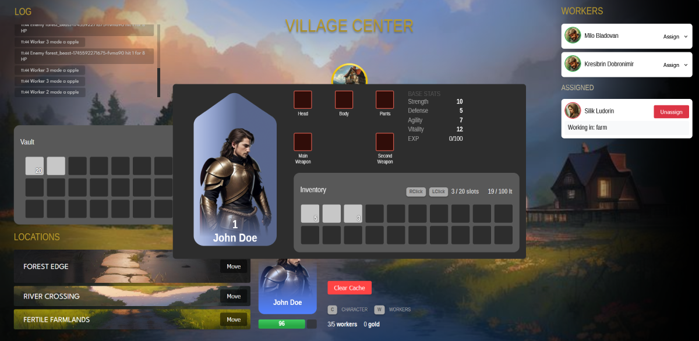

# Idler

Very early stage for an RPG-idler(browser) game built with React, Redux & Parcel.



## TO-DO
#### Player
- [ ] `Player` death & punishment(15% lost EXP)
- [ ] `Player` skills(ex powerful skill, AOE skill)

#### Enemies
- [ ] `Enemy` pool should attack(all at once) in different delay times 
- [ ] `Enemy` pool should have different `enemies`
- [ ] `Enemy`(some) should have a chance to become a `worker`

#### Mechanics
- [ ] Calculate DMG/DEF with `stats`, `equipment`, `skills`(?)
- [ ] `Inventory` should display a slider when item quantity is more than 1
- [ ] `Recipies`(ex 10x apple's -> apple-pie)
- [ ] Able to sell items for gold
- [ ] Melt equipment for crafting materials
- [ ] `Crafting` equipment(cost gold/crafting materials)
- [ ] `NPC` dialog

#### Other
- [ ] `Log` better format for better readability
- [ ] Alert `player` he cant carry that much `weight`
- [ ] `Engine` better performance iterations, maybe abstract to a class? for re-use
- [ ] Icons

## Setup

### Install
```bash
npm install
```

### Environments
Create `.env.development` and `.env.production` at project root:
```env
API_URL=...
```

### Scripts
- `npm start` → dev server (Parcel)
- `npm run build` → production build
- `npm test` → run tests (Vitest)

## Project Structure
```text
src/
  game/
    engine/      # core game loop & mechanics
    factory/     # entity factories (items, monsters)
    services/    # game services (inventory, combat)
    utils/       # utility functions
  ui/
    layouts/
      GameLayout.js   # root layout combining UI sections
    hooks/
      useGameState.js # hook to access & dispatch game state
    components/
      common/
      sections/
      display/
  store/
    slices/     # Redux slices (combat, places, inventory, etc.)
  assets/       # static assets
```

## How It Works

The app is bundled by Parcel, renders a React application, and uses Redux for state management. Services and factories encapsulate game logic.

## Game Mechanics

- Idle resource generation: items/resources accumulate over time or via actions.
- Combat system: toggle combat state via Redux slice to simulate battles.
- Inventory management: add/remove items per location with `InventoryService`.
- Factories: generate game entities (items, monsters, etc.) at startup.

## Assets

### Backgrounds/avatars

- **Perchance**: https://perchance.org/ai-text-to-image-generator
- **Idylwilds Armory**: https://idylwild.itch.io/idylwilds-armory

## Libraries & Packages

### Production dependencies
- **react**, **react-dom**: UI framework
- **redux**, **react-redux**, **@reduxjs/toolkit**: state management

### Dev dependencies
- **parcel**, **@parcel/config-default**, **@parcel/plugin**, **@parcel/resolver-glob**, **@parcel/transformer-image**: bundler & plugins
- **cross-env**: cross-platform environment variables
- **vitest**: testing framework
- **@babel/core**, **@babel/preset-react**: transpilation
- **process**, **sharp**: polyfills & image transformations

## License
MIT
